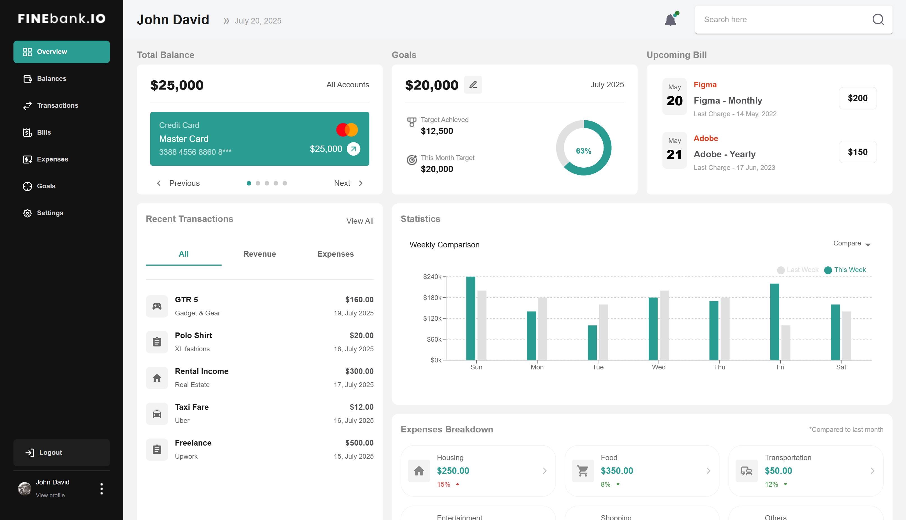

# 💳 Finebank.io – Modern Banking Dashboard

Finebank.io is a **responsive**, **feature-rich** banking dashboard built using **React**, **TypeScript**, **MUI**, and **Recharts**. It mimics a high-end desktop experience, with full functionality even at 1024px screen width.

---

## 🚀 Features

- 🔐 **Login**: Secure authentication with email/password and Google OAuth
- 🧭 **Sidebar Navigation**: Multi-page layout with responsive sidebar
- 📊 **Dashboard Widgets**:
  - Account balances
  - Goals tracker (gauge chart)
  - Upcoming bills & recent transactions
  - Weekly/monthly expense chart
  - Expense breakdown by category
- 📱 **Responsive Design**: Optimized for 1024px and above (desktop-first)
- 💅 **Custom Components**: Buttons, cards, modals, and more
- ⚡ **Vite-powered** with TypeScript support
- 📁 **Modular Folder Structure** for scalability

---

## 🖼 Screenshot

### 🏠 Dashboard Overview



---

## 🛠 Tech Stack

| Layer            | Stack / Libraries          |
| ---------------- | -------------------------- |
| UI Framework     | React 18, TypeScript, Vite |
| Styling          | MUI v5, Emotion            |
| Charts           | Recharts                   |
| Routing          | React Router v7            |
| State Management | React Hooks                |
| Build Tools      | Vite, TypeScript           |
| Deployment       | Vercel          |

---

## 📁 Project Structure

finebank.io/
├── public/ # Static assets
├── screenshots/ # Project screenshots (PNG files)
├── src/
│ ├── assets/ # Icons, images
│ ├── common/ # Shared components (Button, Chart, Navbar, etc.)
│ ├── pages/ # Route pages (Dashboard, Login, Balances, etc.)
│ ├── routes/ # App routing logic
│ ├── theme/ # MUI theme customization
│ └── main.tsx # App entry point
├── tsconfig.json # TypeScript configuration
├── vite.config.ts # Vite configuration
├── package.json # Project dependencies and scripts
└── README.md # Project documentation

---

## 🔧 Getting Started

### 1. Clone the repo

```bash
git clone https://github.com/JeevanA1999/finebank.io.git
cd finebank.io
2. Install dependencies

npm install
3. Start development server
npm run dev
Visit http://localhost:5173 to view the app in your browser.

⚙️ Production Build
To create an optimized production build:
npm run build

To preview the production build locally:
npm run preview

Production Build
To create an optimized production build:


npm run build
To preview the production build locally:


npm run preview
🚀 Deployment
You can deploy the app easily to Vercel, Netlify, or similar platforms:

Connect your GitHub repo

Set build command as: npm run build

Set output directory as: dist/

🧭 Developer Notes
✅ Responsive logic: 1024px layout matches desktop view (like 1440px)

🔠 TypeScript Safety:

Strict typing for all components

Uses import type for type-only imports

🎨 Theming: MUI customization with createTheme under src/theme

🔄 Scalable Layout: Easily extend to add settings, profile, etc.

📋 Future Enhancements
🔐 Real authentication with JWT or Firebase

🌐 Backend API (REST or GraphQL)

🧑‍💼 Profile page and settings

📱 Mobile layout polish

🧪 Component-level unit tests with Jest & React Testing Library

📜 License
Distributed under the MIT License. See the LICENSE file for more info.

👨‍💻 Maintainer
Built and maintained by Jeevan A
Feel free to ⭐ the repo, fork it, or contribute improvements.

---

```
